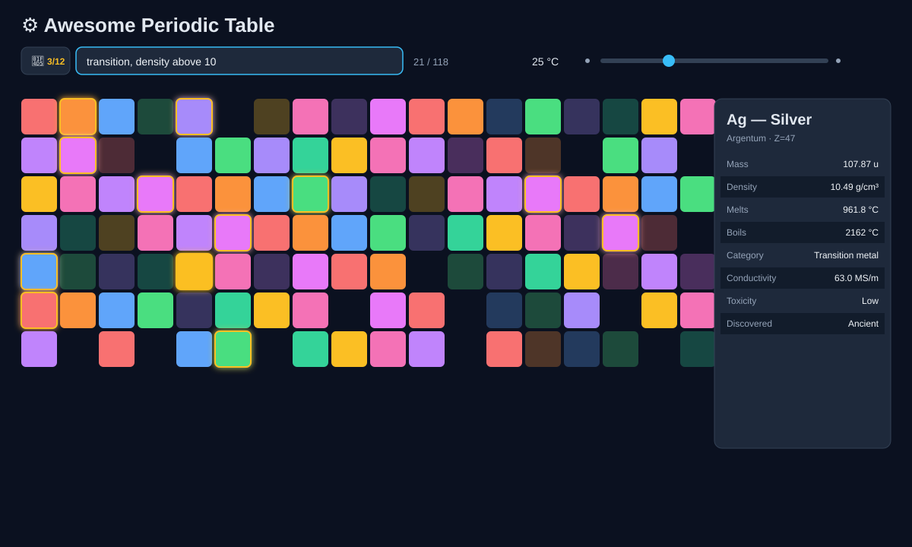
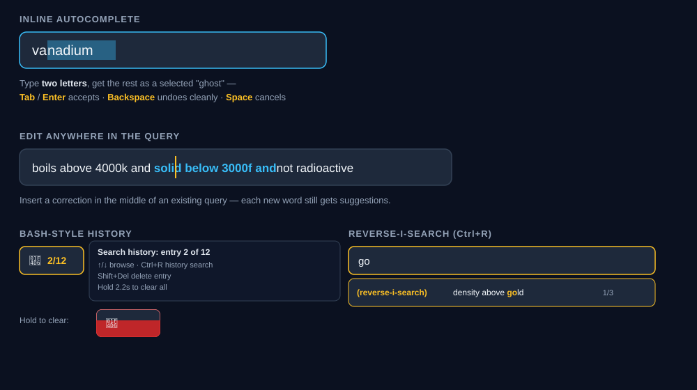

# ⚛ Awesome Periodic Table

A single-file, dependency-free, interactive periodic table for the web — with a natural-language search engine, bash-style search history, inline autocomplete, temperature-driven phase simulation, and a searchable in-app help system.

Open the HTML file. That's the whole install process.




> The two images above are illustrative diagrams built from the app's actual color palette and layout (wil be replaced by screenshots soon)

---

## What this is

Awesome Periodic Table is one self-contained `.html` file that renders a full, temperature-aware periodic table and lets you filter it with a search grammar expressive enough to answer questions like *"transition elements, not toxic, with electrical conductivity above titanium's"* — while staying simple enough that `gold` or `Fe` just work too.

There's no framework, no build step, and no external assets. All 118 elements' data is packed into a handful of compact custom-encoded arrays in the script itself (not a bloated JSON blob), which keeps the file small even as more properties get added.

## Features

- **A real query grammar, not just substring search.** Supports `AND`, `OR`, comma-separated criteria, `NOT` (usable anywhere, including mid-chain: `transition and not toxic`), numeric and element-relative comparisons (`density above 10`, `melts above iron`), ranges (`boils between Po and Osmium`), superlatives (`most dense radioactive element`), and labelled lookups (`category: transition`, `toxicity: High`). The in-app Help panel documents the full grammar and is itself searchable.
- **Two independent mouse modes.** Left-click selects an element and locks the details panel so hovering elsewhere doesn't overwrite it; right-click selects and starts a comparison mode, letting you hover other elements to see them compared against your pick. Both work identically on filtered results. `Esc` clears everything.
- **Temperature-driven phase simulation.** Drag the slider (or type an exact value) from −273 °C to 6000 °C and watch every element's solid/liquid/gas badge — and category-specific magnetism — update live.
- **Bash-style search history.** Persisted across sessions (localStorage → cookie → memory fallback chain), capped at 50 entries, oldest evicted first. Because search is incremental, a query is only recorded once you pause for about a second (or hit Enter) — half-typed fragments like `"boi"` never clutter it. `↑`/`↓` to browse, `Ctrl+R` for bash-style reverse-i-search, `Shift+Del` to drop a single entry, and a press-and-hold gesture on the history button to wipe it all.
- **Inline autocomplete**, address-bar style: type `va`, see `va` + a selected, ghosted `nadium`. Keep typing to refine it, `Tab`/`Enter` to accept, `Space` to dismiss. It works in the middle of an existing query too, not just at the end of the line.
- **A searchable, collapsible Help panel** — every topic is a `<details>` section with a live text filter over all of them.
- **Zero dependencies, zero network calls.** Everything above runs from one static file. It works over `file://`, from a USB stick, embedded in an LMS, or offline on a plane.

## Quick start

1. Download `awesome-periodic-table.html`.
2. Double-click it, or drag it into a browser tab.
3. Start typing in the search bar.

That's it — no server, no `npm install`, no build step.

### Try these

| Type this | You get |
|---|---|
| `gold` | Just gold. Symbol, name, or Latin name all work. |
| `noble gas` | The 6 noble gases. Singular, plural, or hyphenated forms all resolve the same way. |
| `liquid and gas` | Nothing — a sanity check; no element is both at once. |
| `density between silver and gold` | The 24 elements whose density falls between Ag's and Au's — inclusive of Ag and Au themselves. |
| `lightest nonmetal` | Hydrogen. |
| `most dense radioactive element` | Hassium. |
| `metalloids more dense than B and less dense than Te` | Germanium and Arsenic. |
| `transition, not toxic, electrical conductivity above Titanium's` | 8 elements — try it with `and` instead of commas and get the identical result. |

Then try the things that aren't a single query:

- Drag the temperature slider past 3000 °C and watch most of the table turn to gas.
- Left-click an element, then hover others — the details panel stays locked on your pick.
- Right-click a different element instead — now hovering compares each one against it.
- Type a couple of searches, then press `Ctrl+R` and type a fragment of one of them.
- Click the 📕 button and hold it for two seconds.

## Limitations

- **Single language, English grammar.** The query parser's synonyms, filler-word stripping, and comparative phrases (`more dense than`, `after 1900`, etc.) are English-only.
- **Ambiguous short queries fall back to element symbols.** A bare `in` or `at` resolves to Indium/Astatine rather than being treated as English prepositions — a deliberate tradeoff for a chemistry tool, but worth knowing.
- **No persistence of anything except search history.** Temperature, selection, and comparison state reset on reload; only your query history survives (via localStorage, falling back to a cookie, falling back to memory-only for the session if both are blocked — e.g. some browsers restrict storage on `file://` pages).
- **Superlatives and comparisons trust the bundled data.** A handful of properties for synthetic, extremely short-lived superheavy elements (thermal/electrical conductivity, density) are theoretical/predicted values, not measurements — this is noted in the data but easy to miss if you're skimming.
- **No mobile-specific input handling beyond responsive CSS.** Mouse-mode right-click and hold-to-clear gestures both work with touch equivalents, but haven't been tested across every mobile browser.
- **Not a substitute for a reference textbook.** It's a fast way to explore and cross-filter the periodic table, not a citable source for exact physical constants. Meant for educational purposes.

## Project structure

This is intentionally a single file — there is no build output to keep in sync, no `dist/` folder, nothing to compile. If you're browsing the repository:

```
awesome-periodic-table.html   ← the entire application
README.md                     ← this file
docs/                         ← illustrations referenced by this README
```

## Contributing

Issues and pull requests are welcome on the [GitHub repository](https://github.com/bert2020-dev/awesome-periodic-table). Because everything lives in one file, the easiest way to verify a change is to open it in a browser and use the query examples above as a smoke test.

## Credits

Created and maintained by [**bert2020-dev**](https://github.com/bert2020-dev).

Repository: **[github.com/bert2020-dev/awesome-periodic-table](https://github.com/bert2020-dev/awesome-periodic-table)**

Element data compiled from standard public references (IUPAC atomic weights, CRC-style physical property tables, and public discovery-history records).
